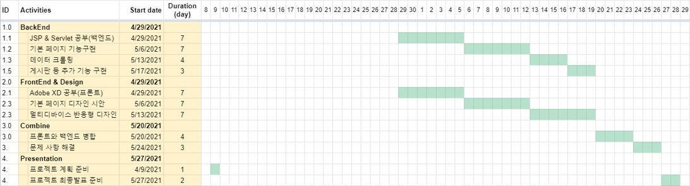
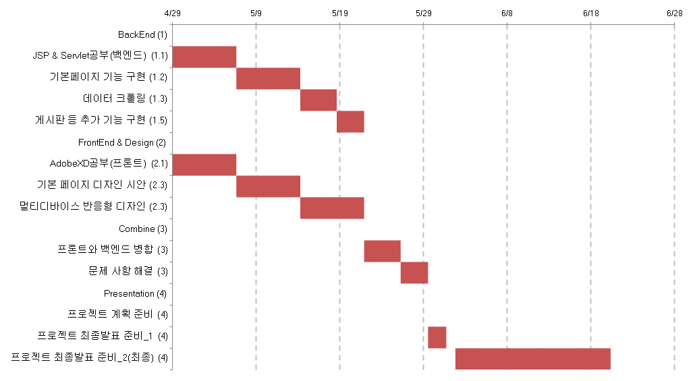
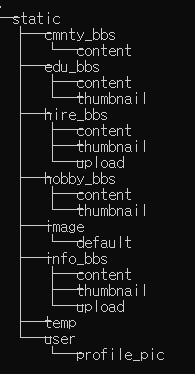

# active_senior
열정적인 연장자들을 위한 홈페이지

인간의 활동 가능 연령대와 생존기간은 높아지고 있는데, 사회가 아직 그것을 못받아 들이고 있다.
정년 후에도 아직 일을하고 싶은 사람도 있을 것이고, 취미로 사람들과 모여 엔터테이먼트를 하고 싶은 사람도 잇을것이다.

하지만 시니어 구직에 대한 정보도 인터넷에서 찾기도 힘들고, 정보 취합도 잘 되어있지 않다.
그리고 따로 커뮤니티 같은 것도 없었다.

은퇴를 하고 나이를 먹으면 활동량이 자연스럽게 줄고, 움직임이 적어지고 우울증에 시달리는 시니어가 많다.

자신이 여전히 가용성 있는 사람이라는 것을 인식할수 있게하고, 활동적으로 할수 있는 무언가 할일을 제공하는게 본 사이트의 취지이다.

은퇴 후에도 이전에 일했던 기술력이 사라지는것이 아닌데도 본인의 기술을 활용하지 못한체 일하는 시니어들도 많았다.

이러한 액티브 시니어들이 활동할 수 있는 커뮤니티 + 정보를 제공하는 사이트를 만들고자 한다.
스마트폰을 사용하지 못하던 시니어들을 갔다. 신규 시니어들은 50대때부터 스마트폰을 사용해왔던 세대이기 때문에 시니어 대상 플랫폼을 만들어도 충분히 참여 가능할 수 있을거라 생각한다.


# 환경
* Window10 64bit
* Intellij Ultimate 2021.1
* java 1.8.0_281
* Tomcat 8.5
* Mysql 8.0.24


# 사이트 구성


- 메인페이지: 이벤트&행사, 각 게시판 다이렉트 링크, 취미 정보를 하나의 페이지에 취합
- 구인 & 고용 게시판 : 아이 돌보기, 집청소, 애완견돌보기 같은 단순한 단발성 업무도 ok, 정부 사업 같은것 등 구인 정보도 업로드
- 교육: 핸드폰 사용법, 글쓰기, 뮤지컬 감상 등 교육 영상 및 후기
- 취미 게시판: 취미로 같이 등산을 하거나, 축구를 하거나 여행을 한 경험에 대한 공유
- 정보 공유(혜택&행사정보): 이벤트&행사 정보, 정부 지원사업, 채용정보 등 공유
- 커뮤니티 게시판 : 시니어들이 자유롭게 대화를 나눌 수 있는 게시판

# 포지션
* 기획 & 디자인 & 프론트: Adobe XD (2명) 이예은, 이태환
* 백엔드: jsp & servlet, 크롤링 (2명) 이지원, 장진호
* 서류관리 & ppt & 발표 (1명) 장진호

# 계획


# 실제 개발일정


# 고려사항
* 어떻게 시니어들이 우리가 만든 사이트를 주기적으로 들어올 수 있게 할것인가?
* 눈이 잘 안보이시기 때문에 직관성있는 UI/UX와 확대 가능한 사이트여야함

# crawler
만든 사이트의 컨텐츠를 채우기 위해 아래 사이트에서 크롤링 하였다. 사이트 구조를 먼저 파악하고 해서 겹치는 부분 메소드화 해서 짰어야했는데 무식하게 하나하나 다 짰다..

대상 사이트의 특정 게시판의 썸네일, 이미지, 컨텐츠, 제목, 작성일, 파일 등을 다운로드 받고 pymysql을 통해 데이터베이스에 업데이트 된다.

## 대상 사이트

* [50플러스 재단](https://50plus.or.kr/)
* [딴지일보](https://www.ddanzi.com/)


## 파일폴더 구조



# 프로젝트 페이지
## JSP페이지구성
* index - 메인페이지
* login - 로그인 페이지
* register - 회원가입 페이지
* account - 유저 정보 수정 페이지
* admin - 관리자 페이지
* forgotPassword - 비밀번호 초기화 페이지
* sendPassword - 비밀번호 초기화 결과 페이지
* navbar - 위에 메뉴
* footer - 맨아래footer부분
* activeSenior - 액티브 시니어 소개
* errorPage - 에러페이지
* introduce - 사이트 소개
* app - 구인&고용 게시판
  * appList
  * appUpdate
  * appView
  * appWrite
* edu - 교육 게시판
  * eduList
  * eduUpdate
  * eduView
  * eduWrite
* info - 정보 게시판
  * infoList
  * infoUpdate
  * infoView
  * infoWrite
* hobby - 취미 게시판
  * hobbyList
  * hobbyUpdate
  * hobbyView
  * hobbyWrite
* cmnty - 커뮤니티 게시판
  * cmntyList
  * cmntyUpdate
  * cmntyView
  * cmntyWrite
  * editComment

## Servlet구성
* logoutAction - 로그아웃
* accountAction - 계정 정보 업데이트
* loginAction - 로그인 처리
* registerAction - 회원가입 처리
* downloadAction - static폴더의 txt, hwp, pdf 등 파일을 다운로드 받을때 사용
* setRecommend - 추천
* cancelRecommend - 추천 취소
* app - 구인&고용 게시판
  * appDeleteAction
  * appUpdateAction
  * appWriteAction
* edu - 교육 게시판
  * eduDeleteAction
  * eduUpdateAction
  * eduWriteAction
* info - 정보 게시판
  * infoDeleteAction
  * infoUpdateAction
  * infoWriteAction
* hobby - 취미 게시판
  * hobbyDeleteAction
  * hobbyUpdateAction
  * hobbyWriteAction
* cmnty - 커뮤니티 게시판
  * cmntyDeleteAction
  * cmntyUpdateAction
  * cmntyWriteAction
  * cmntyCommentAction
* json - json형태로 데이터 던져줌
  * HobbyContentServlet

## DTO(data transfer object)
* User
* CommunityBbs
* CommunityComment
* EduBbs
* HireBbs
* HobbyBbs
* InfoBbs
* RecommendTable

## DAO(data access object)
* CommunityBbsDAO
* CommunityCommentDAO
* EduBbsDAO
* HireBbsDAO
* HobbyBbsDAO
* InfoBbsDAO
* RecommendTableDAO
* UserDAO

## 기능
* filter.CharsetEncodingFilter - 모든 페이지의 request를 utf-8형태로 charset을 인코딩
* listener.PathListener - contextPath을 받아와 공유
* listener.DtoListener - dto정보와 sql정보를 기반으로 get, set메소드 초기 정보를 매핑
* tool.DataBaseManager - 데이터베이스의 get, set, insert, update, create 등의 공통된 행위를 일괄처리 할 수 있도록 sql 구문을 짜주거나 해당 dto를 반환
* tool.DateManger - Date 타입을 원하는 형태의 String으로 반환
* tool.EmailManger - 이메일 전송
* tool.EmailRunnable - 이메일 스레드 Runnable 객체
* tool.FileManger - 랜덤한 해쉬 파일이름을 반환
* tool.ImageManger - 이미지 resize, html구문에 있는 base64 -> Image로 변환
* tool.MethodManager - reflect로 get, set 메소드 받아옴(지금은 DtoListener가 이 행위를 상위호환으로 수행)
* PasswordAuthentication - 비밀번호해쉬화&솔팅, 검증
* PostFormManager - Form에서 받은 파라미터, 파일 등을 한번에 처리함
* ScriptManager - Script구문을 처리하여 alert창을 띄우거나, 올바른 결과를 리턴 또는 올바른 페이지로 이동 시켜줌

# 사용 라이브러리 & API
백엔드

* java ee 6
* servlet commons fileupload
* mysql connector(jdbc)
* jai
* javax mail
* Naver Maps

프론트엔드

* jquery
* summernote
* scrollMagic
* gasp(TweenMax)
* font-awesome
* snap
* masonry
* slicker

테스트방식
* e2e

# 프로젝트 기능별 설명


# 프로젝트 세팅 방법

* [☆active_senior.sql다운★](https://drive.google.com/file/d/1bGbnOxfu9VgJNWPMkSTs_X6-IVdRiNUC/view?usp=sharing)을 통해 데이터베이스 세팅
    ```
    // mysqldump -uroot -proot active_senior > active_senior.sql (export database)

    mysqladmin -uroot -p[루트비밀번호] create actvie_senior
    mysql -uroot -p[루트비밀번호] active_senior < active_senior.sql
    ```
* [☆static다운★](https://drive.google.com/file/d/1uI6IG6jgQYJsMgZtU3jL7JWX_tP4l1GS/view?usp=sharing)을 다운받아 `actvie_senior/web/static` 폴더 안에 내용을 옮겨줌(static폴더 통째로 넣기 x)