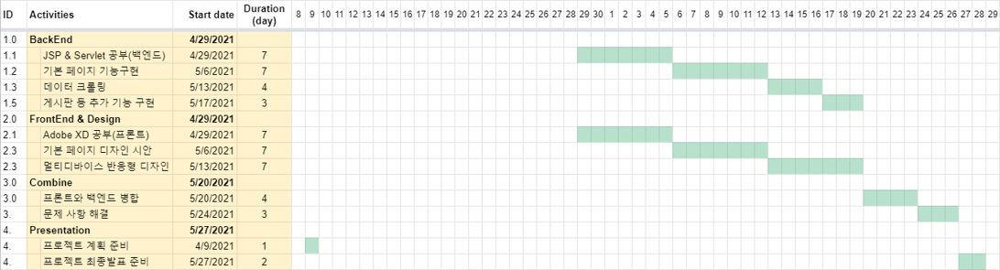

# active_senior
열정적인 연장자들을 위한 홈페이지

인간의 활동 가능 연령대와 생존기간은 높아지고 있는데, 사회가 아직 그것을 못받아 들이고 있다.
정년 후에도 아직 일을하고 싶은 사람도 있을 것이고, 취미로 사람들과 모여 엔터테이먼트를 하고 싶은 사람도 잇을것이다.

하지만 시니어 구직에 대한 정보도 인터넷에서 찾기도 힘들고, 정보 취합도 잘 되어있지 않다.
그리고 따로 커뮤니티 같은 것도 없었다.

은퇴를 하고 나이를 먹으면 활동량이 자연스럽게 줄고, 움직임이 적어지고 우울증에 시달리는 사람이 많다.

자신이 여전히 가용성 있는 사람이라는 것을 인식할수 있게하고, 활동적으로 할수 있는 무언가 할일을 제공하는게 본 사이트의 취지이다.

은퇴 후에도 이전에 일했던 기술력이 사라지는것이 아닌데도 본인의 기술을 활용하지 못한체 일하는 시니어들도 많았다.

이러한 액티브 시니어들이 활동할 수 있는 커뮤니티 + 정보를 제공하는 사이트를 만들고자 한다.
스마트폰을 사용하지 못하던 시니어들을 갔다. 신규 시니어들은 50대때부터 스마트폰을 사용해왔던 세대이기 때문에 시니어 대상 플랫폼을 만들어도 충분히 참여 가능할 수 있을거라 생각한다.

## 생각하는 사이트 구성

- 메인페이지 : 정보 & 추천글 & 인기글
- 구인 & 고용 게시판 : 아이 돌보기, 집청소, 애완견돌보기 같은 단순한 단발성 업무도 ok, 정부 사업 같은것 등 구인 정보도 업로드
- 취미 게시판 : 취미로 같이 등산을 하거나, 축구를 하거나 등 사람을 모으는 목적으로 글을 올리는 게시판
 |_ 구인, 취미는 당근마켓처럼 반경내에 사람이 올린 글만 노출 될 수 있도록
- 정보 공유(혜택&행사정보): 어르신들이 힘들어 하는 키오스크 결제, 나라지원금 신청, 손자들이 좋아하는 물건 등 정보 공유
- 커뮤니티 게시판 : 시니어들이 자유롭게 대화를 나눌 수 있는 게시판

## 포지션
* 기획 & 디자인 & 프론트: Adobe XD (2명) 이예은, 이태환
* 백엔드: jsp & servlet, 크롤링 (2명) 이지원, 장진호
* 서류관리 & ppt & 발표 (1명) 장진호

## 계획

## 고려사항
* 어떻게 시니어들이 우리가 만든 사이트를 주기적으로 들어올 수 있게 할것인가?
* 눈이 잘 안보이시기 때문에 직관성있는 UI/UX와 확대 가능한 사이트여야함